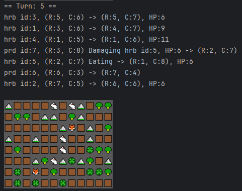

# Симуляция 2D мира



Симуляция населена травоядными (🐇) и хищниками (🦊). Кроме существ, мир содержит ресурсы — траву (🍀), статичные объекты: горы (⛰️), деревья (🥦).

## Описание проекта

- Хищники стремятся напасть на травоядное;
- Травоядные стремятся съесть траву;
- Если отсутствует определенное количество травоядных и травы, то они появятся вначале хода;
- Каждое существо наделяется случайными параметрами:
    - Травоядные — количеством жизни, скоростью перемещения;
    - Хищники — диапазоном урона, скоростью перемещения;
- Статичные объекты блокируют движения;
- Карта представлена размером **8x12**.

## Структура программы

Проект написан на версии java 23.0.2.
- `actions` — действия внутри симуляции;
- `entity` — объекты (существа и статичные объекты) симуляции;
- `gamemap` — хранение существ на карте, рендер карты;
- `menu` — создание меню, проверка ввода, вывод меню;
- `parameters` — параметры-константы для симуляции;
- `pathfinder` — реализация алгоритмов bfs и А*;
- `simulatuion` — основной класс запуска симуляции.

## Запуск программы

```bash
git clone https://github.com/LlqWst/Simulation.git
cd simulation/src/main/java/io/example
java Main.java